# Anantah Platform Technical Specification

**Document status:** Draft for implementation planning  
**Product:** Anantah.space  
**Target backend:** .NET 10 LTS and C#  
**Frontend baseline:** Existing React and TypeScript micro-frontends  
**Last updated:** July 27, 2026

## 1. Purpose

Anantah is a shared digital platform built around the idea of unlimited space for creating, discovering, shopping, and playing. The platform will initially contain three product families:

1. **Anantah Space Intelligence**: a multimodal assistant for conversation, research, file analysis, image generation, video generation, and delegated agent work.
2. **Anantah Space Fashion**: a premium fashion commerce experience for clothing, shoes, bags, and watches.
3. **Anantah Space Play**: a games portal and platform supporting 2D and 3D games, offline play, online multiplayer, profiles, achievements, and social features.

This specification describes the target architecture, product boundaries, security model, data model, APIs, infrastructure, delivery stages, and operational requirements. It is intentionally more detailed than an MVP backlog, but it distinguishes initial requirements from later capabilities.

## 2. Product Principles

- **One Anantah identity:** a user has one profile, preference set, wallet/entitlement view, and trust relationship across all products.
- **Explicit capability consent:** internet access, external agents, connected accounts, and sensitive actions require separate user-controlled permissions.
- **Offline means offline:** when Local Only mode is selected, no request, telemetry event, DNS lookup, model call, or asset fetch may leave the device.
- **Provider independence:** AI models, payment services, search providers, storage, and deployment targets are accessed through application-owned abstractions.
- **Progressive complexity:** begin with a modular monolith and isolated workers; split services only when ownership, scaling, reliability, or compliance justifies it.
- **Premium but usable:** visual quality must not compromise accessibility, performance, clarity, or purchase and play workflows.
- **Secure by default:** least privilege, short-lived credentials, tenant isolation, auditability, and safe file processing are platform requirements.

## 3. Scope

### 3.1 Initial scope

- Shared identity and user profiles.
- API gateway and backend-for-frontend endpoints for the existing React shell.
- Streaming AI chat with online and local model adapters.
- Image and document uploads with multimodal analysis.
- Web search and retrieval-augmented generation with citations.
- Asynchronous image generation.
- Fashion catalog, cart, checkout, payment, order, and inventory foundations.
- Game catalog, profiles, achievements, leaderboards, and one offline-capable game.
- Shared notifications, audit logs, telemetry, and administrative operations.

### 3.2 Later scope

- Video generation and editing pipelines.
- Delegation to third-party agents and connected user accounts.
- Marketplace support for designers, creators, or game studios.
- Competitive real-time multiplayer and dedicated authoritative servers.
- Native desktop/mobile companions.
- Subscription bundles spanning AI, commerce benefits, and games.

### 3.3 Explicit non-goals for the first release

- Training a foundation model from scratch.
- Building a custom payment processor.
- Building a low-latency multiplayer engine on SignalR.
- Supporting arbitrary untrusted code execution inside the primary API process.
- Splitting every domain into an independently deployed microservice before usage data exists.

## 4. Recommended Technology Baseline

| Concern | Recommended technology | Notes |
| --- | --- | --- |
| Runtime | .NET 10 LTS for Fashion; Python 3.14 for Intelligence | Keep commerce rules in C# and model/tool orchestration in an isolated Python process. |
| API framework | ASP.NET Core for Fashion; FastAPI target for Intelligence | The dependency-free Python HTTP bootstrap is temporary until FastAPI installation is approved. |
| Local orchestration | .NET Aspire | Service discovery, health, telemetry, and local dependencies. |
| API gateway | YARP | Routing, rate limits, request correlation, and BFF composition. |
| Frontend | Existing React 19 + TypeScript MFEs | Add Intelligence, Fashion, Play, and Admin remotes over time. |
| Authentication | OpenID Connect and OAuth 2.1 | Use a standards-based identity provider; support passkeys and MFA. |
| Primary database | PostgreSQL | Relational source of truth for identities, products, orders, and platform state. During bootstrap, use a small internal SQLite store per module and migrate to PostgreSQL before scale-out. |
| ORM | Entity Framework Core | Separate `DbContext` and migrations by bounded context. |
| Vector retrieval | PostgreSQL with `pgvector` | Start here; move high-scale retrieval to a dedicated vector engine if needed. |
| Cache | Redis | Sessions, rate limits, presence, distributed locks, and hot data. |
| Event transport | RabbitMQ locally; managed broker in production | Use an outbox; do not dual-write database and broker directly. |
| Object storage | S3-compatible storage or Azure Blob Storage | Original uploads, generated media, product assets, and game packages. |
| Realtime | SignalR | AI job progress, notifications, presence, lobbies, and turn-based games. |
| AI abstractions | Provider-neutral Python ports/adapters | Keep model clients behind application-owned interfaces. |
| Agent orchestration | Python agent service; Microsoft Agent Framework or equivalent where appropriate | Tool calling, workflows, state, and delegated agents remain isolated from commerce. |
| Local model runtime | Ollama or llama.cpp | Optional local companion/service, not hosted in the browser. |
| 2D games | Phaser | Preferred free HTML5 framework for lightweight browser games; installation awaits approval. |
| 3D games | Unity WebGL | Validate browser memory and download budgets per game. |
| Multiplayer servers | Dedicated authoritative servers | Agones, PlayFab Multiplayer Servers, or another managed host. |
| Observability | OpenTelemetry | Traces, metrics, logs, correlation, and model/tool spans. |
| Tests | xUnit, Testcontainers, Playwright, k6 | Unit, integration, contract, UI, performance, and resilience tests. |

## 5. System Context

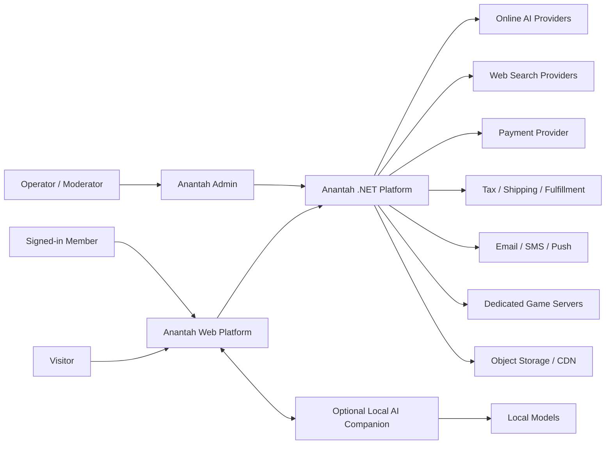

The browser application must not directly hold privileged provider keys. Online model, payment, search, and storage operations flow through the .NET platform. A local companion can expose a loopback-only API for offline models and encrypted local data.

## 6. High-Level Container Architecture

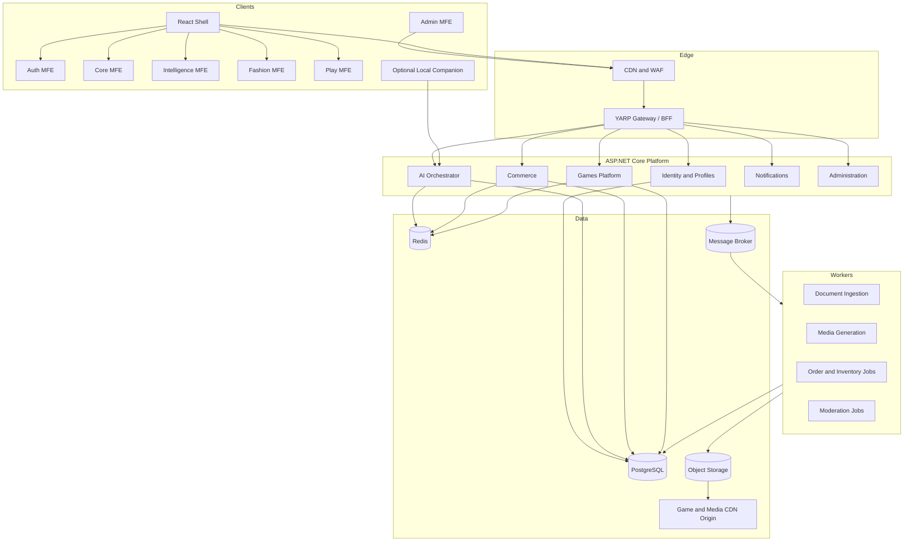

## 7. Architecture Style and Boundaries

### 7.1 Starting architecture

Use a **modular monolith** for transactional business domains plus separate worker processes. A single deployable API may contain multiple modules, but modules must not share domain entities or write directly to one another's tables.

Initial deployables:

- `Anantah.Gateway`: edge routing and backend-for-frontend operations.
- `Anantah.Platform.Api`: identity integration, profiles, AI orchestration, commerce, games platform, and administration modules.
- `Anantah.Workers`: document ingestion, media generation, notifications, and integration event handlers.
- `Anantah.AppHost`: .NET Aspire local orchestration.
- `Anantah.LocalCompanion`: optional later desktop service for true offline AI.

### 7.2 Extraction criteria

Extract a module into a separately deployed service only when at least one condition is demonstrated:

- It has a materially different scaling profile.
- It needs a different availability or deployment cadence.
- It handles a separate compliance boundary.
- It is owned by a separate team with a stable contract.
- Failures must be isolated from the rest of the platform.

Media generation workers and authoritative game servers meet these criteria early. Product catalog CRUD does not.

### 7.3 Dependency rule

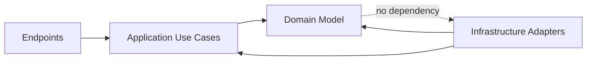

- Domain projects contain entities, value objects, invariants, and domain events.
- Application projects contain commands, queries, authorization policies, and ports/interfaces.
- Infrastructure projects contain EF Core, providers, message transport, blob storage, and external API clients.
- API projects translate HTTP contracts into application use cases.

## 8. Proposed Repository Layout

```text
ANANTAH/
  docs/
    ANANTAH-PLATFORM-TECHNICAL-SPECIFICATION.md
    decisions/
  UI/
    anantah-shell/
    anantah-auth-mfe/
    anantah-core-mfe/
    anantah-ai-mfe/                 # future
    anantah-commerce-mfe/           # future
    anantah-games-mfe/              # future
    anantah-admin-mfe/              # future
  microservices/
    Anantah.slnx
    global.json
    Directory.Build.props
    Directory.Packages.props
    src/
      Anantah.AppHost/
      Anantah.ServiceDefaults/
      Anantah.Gateway/
      Anantah.Platform.Api/
      BuildingBlocks/
      Modules/
        Identity/
        Intelligence/
        Commerce/
        Games/
        Notifications/
        Administration/
      Workers/
        Anantah.Ingestion.Worker/
        Anantah.Media.Worker/
        Anantah.Notifications.Worker/
      Anantah.LocalCompanion/        # later
    tests/
      Architecture/
      Unit/
      Integration/
      Contract/
      EndToEnd/
    deploy/
      containers/
      infrastructure/
```

Use central package management and treat warnings as errors for application-owned projects. Keep API contracts backward compatible and generate TypeScript clients from versioned OpenAPI documents.

# Part I: Shared Platform

## 9. Identity, Accounts, and Authorization

### 9.1 Identity capabilities

- Registration, login, logout, account recovery, and email verification.
- Passkeys/WebAuthn, optional passwords, and MFA.
- Social or enterprise identity providers through OIDC.
- User profile, avatar, locale, currency, timezone, and accessibility preferences.
- Age and regional policy signals where games or generated content require them.
- Device/session management and remote session revocation.
- Consent records for analytics, model improvement, connected tools, and marketing.
- Roles for member, support, moderator, merchandiser, fulfillment operator, game operator, and platform administrator.

### 9.2 Authorization model

Use policy-based authorization combining:

- **RBAC** for operational roles.
- **Resource ownership** for conversations, uploads, carts, orders, and saves.
- **Capability scopes** for AI network and tool access.
- **Entitlements** for subscriptions, purchased games, and premium features.

Never trust role names supplied by a frontend. Resolve roles, scopes, and ownership server-side.

### 9.3 Shared profile identifiers

Use immutable UUIDv7 identifiers internally. User-visible handles and slugs can change. Do not use email addresses as foreign keys or public identifiers.

## 10. API Gateway and BFF

The gateway is responsible for:

- TLS termination behind the edge/CDN.
- Authentication challenge and token validation.
- Route mapping to platform APIs and game services.
- Per-user, per-IP, and per-operation rate limits.
- Correlation and trace identifiers.
- Request-size limits and upload-session initiation.
- BFF aggregation where one UI screen needs multiple modules.
- Security headers, CORS, and anti-forgery controls.
- Stable public API versioning.

Do not place business rules in YARP transforms. Business authorization remains in the owning module.

## 11. Shared Data and Integration

### 11.1 Data ownership

Each module owns a database schema and migrations:

| Schema | Owns |
| --- | --- |
| `identity` | Profiles, preferences, consents, devices |
| `intelligence` | Conversations, messages, model runs, tools, knowledge |
| `commerce` | Catalog, prices, inventory, carts, orders, returns |
| `games` | Games, players, saves, achievements, matches |
| `notifications` | Templates, preferences, delivery attempts |
| `platform` | Audit records, feature flags, outbox/inbox infrastructure |

Cross-module reads use APIs, projections, or integration events. They do not use cross-schema EF navigation properties.

### 11.2 Reliable events

Use transactional outbox and idempotent inbox patterns.

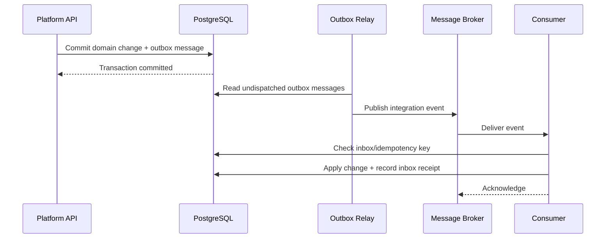

Initial integration events include:

- `UserRegistered`
- `ConsentChanged`
- `ConversationCompleted`
- `MediaGenerationCompleted`
- `ProductPublished`
- `InventoryChanged`
- `OrderPlaced`
- `PaymentAuthorized`
- `OrderShipped`
- `GamePublished`
- `AchievementUnlocked`
- `MatchCompleted`

Events are facts in past tense. Commands such as `GenerateImage` are sent explicitly to a job queue and are not disguised as domain events.

## 12. File and Media Pipeline

All product families need safe uploads and media delivery.

1. Client requests an upload session with filename, size, content type, checksum, and purpose.
2. API validates quota and returns a short-lived signed upload URL.
3. Client uploads directly to quarantine storage.
4. Storage event creates a scan job.
5. Worker validates signature/magic bytes, malware status, dimensions, duration, and archive safety.
6. Worker strips unsafe metadata and creates normalized derivatives.
7. Asset becomes `Ready`, or `Rejected` with a user-safe reason.
8. Private downloads use short-lived signed URLs; public product/game media is distributed through a CDN.

Never process arbitrary uploads synchronously in the API request and never trust the browser-provided MIME type.

# Part II: Anantah Space Intelligence

## 13. Intelligence Product Requirements

### 13.1 Conversation

- Create, rename, archive, delete, export, branch, and share conversations.
- Stream assistant responses incrementally.
- Regenerate or edit a previous turn without corrupting history.
- Support text, images, PDFs, office documents, audio, and structured data attachments.
- Show model, mode, tools used, citations, cost/usage, and generation status.
- Allow stop/cancel during streaming and long-running tool calls.
- Support temporary conversations excluded from long-term history.
- Allow user memory only through transparent, editable memory records.

### 13.2 Creation studio

- Text-to-image and image-to-image generation.
- Aspect ratio, style, quality, seed, count, and negative-prompt controls where supported.
- Image variation, background removal, expansion, and inpainting as later features.
- Text-to-video and image-to-video through asynchronous provider jobs.
- Job queue with states: `Queued`, `Running`, `Succeeded`, `Failed`, `Cancelled`, `Expired`.
- User media library with prompt lineage, model metadata, and retention controls.

### 13.3 Knowledge and research

- Upload private knowledge collections.
- Extract text and layout, OCR scanned documents, create chunks, embeddings, and keyword index entries.
- Hybrid retrieval using semantic vectors plus full-text search.
- Apply user and collection access filters before retrieval, not after model generation.
- Web search with cited source title, URL, retrieval timestamp, and quoted evidence.
- Treat retrieved pages and documents as untrusted content to reduce prompt-injection risk.

## 14. AI Operating Modes and Permissions

The UI presents two primary modes, but the backend enforces granular capabilities.

### 14.1 User-facing modes

**Local Only**

- Uses an installed local model through `Anantah.LocalCompanion`.
- Stores conversations, attachments, indexes, and settings locally unless the user explicitly synchronizes later.
- Disables web search, online models, cloud image/video generation, external agents, remote telemetry, and cloud history.
- Can analyze local images and documents only if the selected local model supports those inputs.

**Online**

- May use hosted models and web search according to user permissions.
- Does not automatically grant access to connected accounts or other agents.
- Can use cloud image/video generation where the account has quota and policy allows it.

### 14.2 Capability scopes

| Scope | Meaning | Default |
| --- | --- | --- |
| `model.online.invoke` | Send selected input to an online model | Ask on first use |
| `web.search` | Search public web sources | Off per conversation until selected |
| `web.fetch` | Retrieve a selected public page | Derived from search action |
| `files.current.read` | Read attachments in the current conversation | On when attached |
| `knowledge.private.read` | Search selected private collections | Explicit collection selection |
| `media.image.generate` | Generate images online | Ask on first use |
| `media.video.generate` | Generate videos online | Ask on first use |
| `agent.delegate` | Ask another agent to perform work | Off by default |
| `connector.read` | Read from a connected third-party account | Per connector and operation |
| `connector.write` | Change a connected third-party account | Always confirm |
| `commerce.order.read` | Read the user's orders | Ask when first needed |
| `commerce.order.write` | Create/change purchases or returns | Always confirm final action |

A denial must result in a clear degraded path: answer from current context, request permission, or state that the task cannot be completed. The system must never silently broaden access.

### 14.3 Permission decision flow

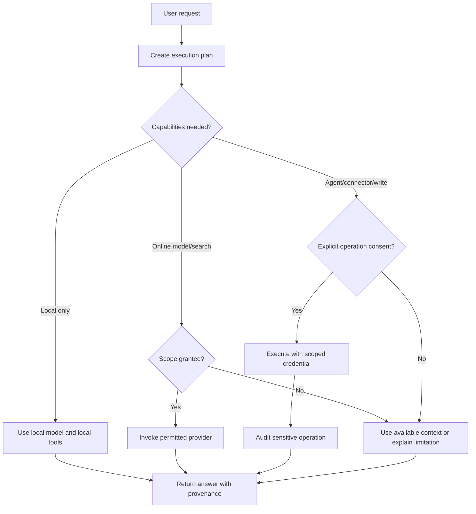

## 15. AI Orchestration Design

### 15.1 Core components

- `ConversationService`: conversation lifecycle and message persistence.
- `ExecutionPlanner`: determines model and allowed tools; it does not grant permissions.
- `ModelGateway`: provider-neutral chat, vision, embeddings, image, and video APIs.
- `CapabilityPolicyService`: evaluates mode, consent, account policy, and operation risk.
- `ToolRegistry`: versioned tool metadata, schemas, scopes, timeouts, and risk levels.
- `AgentDirectory`: internal and external agent descriptors and trust metadata.
- `RetrievalService`: private knowledge and public web evidence retrieval.
- `CitationService`: binds claims to retrievable evidence.
- `UsageService`: token/media usage, budget, quota, and charge attribution.
- `SafetyService`: input/output moderation, jailbreak signals, URL filtering, and policy outcomes.
- `MediaJobService`: asynchronous image/video lifecycle and progress.

### 15.2 Online chat sequence

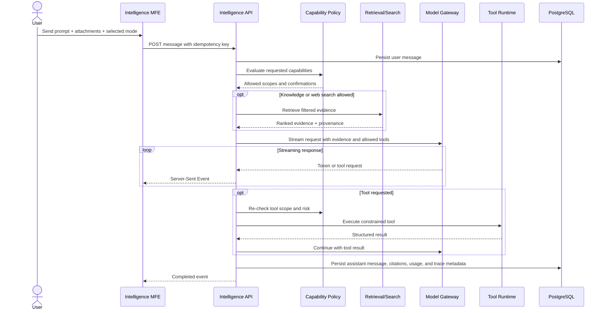

### 15.3 Model routing

Routing inputs:

- Requested mode and capabilities.
- Text, vision, audio, or media output requirements.
- Context-window and latency requirements.
- User plan and remaining budget.
- Regional availability and data residency.
- Provider health and rate limits.
- Safety classification.

Provider fallback is allowed only to a provider covered by the user's online consent and regional policy. Never retry a write-capable tool automatically after an ambiguous timeout.

## 16. Local Companion Architecture

A web browser alone cannot reliably host large local models, protect local data, and provide consistent GPU acceleration. Implement offline mode through an optional signed local service or desktop companion.

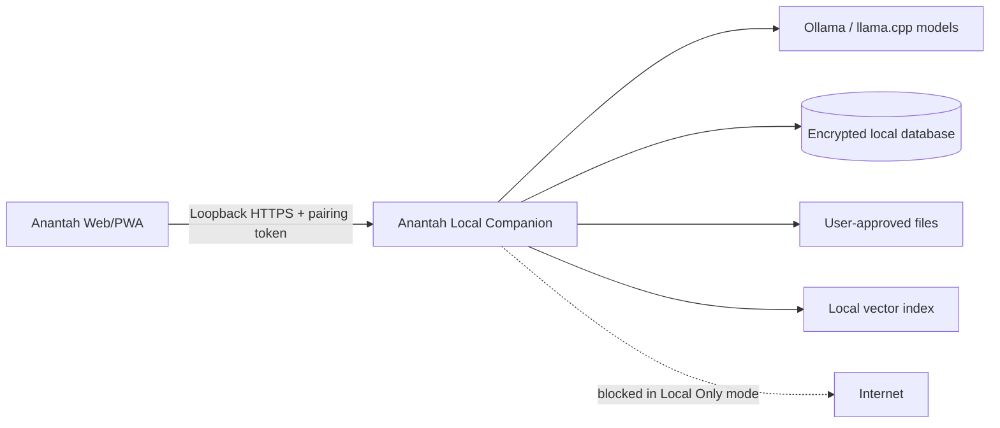

Requirements:

- Listen only on loopback by default.
- Pair browser and companion with an expiring, user-approved token.
- Enforce origin allowlists and CSRF protections.
- Encrypt local conversation metadata and indexes.
- Provide model inventory and capability discovery.
- Expose a network kill switch testable by integration tests.
- Keep cloud synchronization disabled in Local Only mode.
- Clearly report hardware requirements and unsupported modalities.

## 17. AI Data Model

Primary entities:

- `Conversation`: owner, title, mode, retention policy, created/updated timestamps.
- `Message`: role, status, content blocks, parent message, model run, sequence.
- `ContentBlock`: text, image reference, file reference, citation, tool call, tool result.
- `ModelRun`: provider, model, settings, token usage, latency, finish reason, safety outcome.
- `CapabilityGrant`: user, scope, resource boundary, granted/denied, expiry, source.
- `ToolExecution`: tool version, arguments hash, outcome, duration, approval, audit reference.
- `KnowledgeCollection`: owner, visibility, embedding configuration, retention.
- `KnowledgeDocument`: source asset, processing status, checksum, metadata.
- `KnowledgeChunk`: document, location, text, embedding, access filter.
- `GenerationJob`: media type, provider, state, progress, prompt, settings, output assets.
- `MemoryRecord`: transparent user-approved fact, scope, source, expiry.

Conversation content should support typed blocks rather than one large Markdown string.

## 18. Intelligence API Surface

Representative versioned endpoints:

```text
POST   /api/v1/ai/conversations
GET    /api/v1/ai/conversations
GET    /api/v1/ai/conversations/{conversationId}
DELETE /api/v1/ai/conversations/{conversationId}
POST   /api/v1/ai/conversations/{conversationId}/messages
GET    /api/v1/ai/runs/{runId}/events                 # SSE
POST   /api/v1/ai/runs/{runId}/cancel
POST   /api/v1/ai/uploads
POST   /api/v1/ai/knowledge/collections
POST   /api/v1/ai/knowledge/collections/{id}/documents
GET    /api/v1/ai/knowledge/documents/{id}/status
POST   /api/v1/ai/media/images
POST   /api/v1/ai/media/videos
GET    /api/v1/ai/media/jobs/{jobId}
POST   /api/v1/ai/media/jobs/{jobId}/cancel
GET    /api/v1/ai/capabilities
PUT    /api/v1/ai/capabilities/{scope}
GET    /api/v1/ai/models
GET    /api/v1/ai/agents
```

Use idempotency keys for message creation and generation jobs. SSE events must have sequence identifiers so clients can reconnect without duplicating content.

# Part III: Anantah Space Fashion

## 19. Commerce Product Requirements

### 19.1 Storefront

- Editorial home, collections, campaigns, lookbooks, and designer stories.
- Product discovery by category: clothes, shoes, bags, watches, and future categories.
- Search, filtering, sorting, recommendations, recently viewed, and wishlists.
- Product media galleries with zoom, video, color-specific images, and accessible descriptions.
- Variant selection for size, color, material, style, region, and other product-specific dimensions.
- Size guide, fit notes, care instructions, material provenance, and availability.
- Guest and signed-in carts.
- Checkout, tax, shipping, payment, order confirmation, and tracking.
- Returns, exchanges, refunds, cancellations, and customer support workflows.

### 19.2 Operations

- Product and collection administration.
- Draft, scheduled, published, archived, and discontinued lifecycle states.
- Inventory by location with reservation and release.
- Price lists by currency, market, customer segment, and validity period.
- Promotions, gift cards, discount rules, and exclusion rules.
- Fraud-review state and payment reconciliation.
- Fulfillment, split shipments, tracking, return merchandise authorization, and refunds.
- Audit trail for manual price, inventory, and order changes.

## 20. Commerce Domain Model

Key aggregates:

- `Product`: stable identity and merchandising information.
- `ProductVariant`: sellable SKU with selected options, dimensions, barcode, and fulfillment data.
- `Category` and `Collection`: navigation and editorial grouping.
- `PriceList` and `Price`: market/currency amount and validity period.
- `InventoryItem`: on-hand, reserved, available, safety stock, and location.
- `Cart`: lines, market, currency, selected shipping option, and promotion snapshot.
- `Order`: immutable commercial snapshot, totals, addresses, statuses, and lines.
- `Payment`: provider references, authorized/captured/refunded amounts, and event history.
- `Fulfillment`: allocated lines, package, carrier, shipment, and tracking.
- `Return`: requested items, reasons, inspection, refund/exchange outcome.
- `Wishlist`: user-owned product/variant references.

Never calculate historical order displays from the current product or price tables. Store an order-time snapshot.

## 21. Inventory and Checkout Consistency

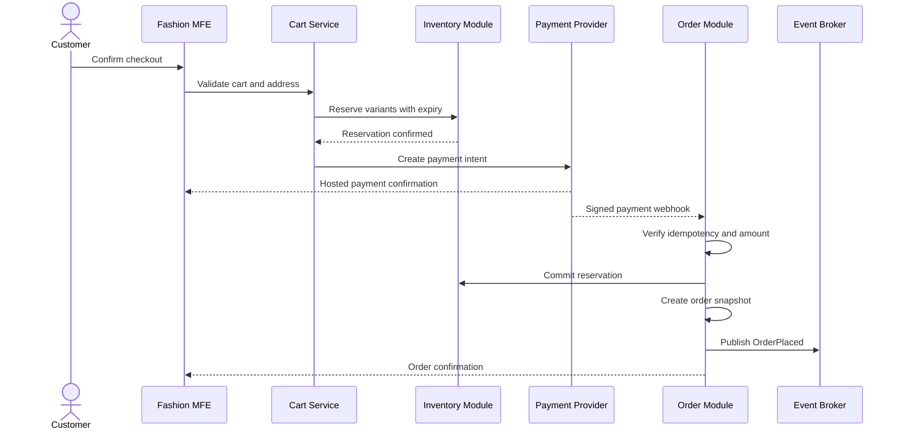

Rules:

- Payment webhooks are authoritative for provider outcomes.
- Verify webhook signatures and store provider event IDs for idempotency.
- Inventory reservations expire and are released asynchronously.
- Order creation, reservation commit, and outbox event write share a transaction where possible.
- Reconcile provider payments against internal records on a schedule.
- Card data must be entered in provider-hosted fields to minimize PCI scope.

## 22. Commerce API Surface

```text
GET    /api/v1/catalog/products
GET    /api/v1/catalog/products/{slug}
GET    /api/v1/catalog/collections/{slug}
GET    /api/v1/catalog/search
GET    /api/v1/catalog/recommendations
GET    /api/v1/cart
POST   /api/v1/cart/items
PATCH  /api/v1/cart/items/{lineId}
DELETE /api/v1/cart/items/{lineId}
POST   /api/v1/checkout/sessions
POST   /api/v1/checkout/{sessionId}/shipping
POST   /api/v1/checkout/{sessionId}/payment-intent
GET    /api/v1/orders
GET    /api/v1/orders/{orderId}
POST   /api/v1/orders/{orderId}/returns
POST   /api/v1/payments/webhooks/{provider}
```

Administrative endpoints live under a separate authorization policy and preferably a separate admin host.

# Part IV: Anantah Space Play

## 23. Games Platform Requirements

### 23.1 Player platform

- Game catalog, tags, screenshots, trailers, requirements, and age ratings.
- Browser launch, installation/PWA state, favorites, and recently played.
- Player profiles, privacy settings, avatars, and status.
- Achievements, leaderboards, progression, cloud saves, and entitlements.
- Friends, blocks, parties, invitations, chat, and presence.
- Matchmaking, private rooms, reconnect, results, and match history.
- Reporting, moderation, parental controls, and play-time controls.
- Offline-capable game packages and save synchronization.

### 23.2 Game integration contract

Each game integrates with an Anantah Game SDK that provides:

- Authenticated player identity and entitlement token.
- Achievement unlock and stat submission.
- Save/load with version and checksum.
- Leaderboard submission with anti-tamper metadata.
- Presence, lobby, party, and invite APIs.
- Match allocation details.
- Telemetry and crash reporting governed by consent.
- Offline queue for supported writes.

Browser games receive short-lived game-specific tokens. They do not receive general platform access tokens.

## 24. Game Runtime Choices

| Game type | Recommended runtime | Networking |
| --- | --- | --- |
| Puzzle, card, board, idle | Phaser or Unity WebGL | Offline or SignalR/HTTP for turn-based play |
| Cooperative casual 2D | Unity WebGL | Managed relay or authoritative room server |
| 3D exploration | Unity WebGL | Offline or authoritative session server |
| Competitive action | Unity client plus dedicated server | UDP/QUIC-capable game networking, not SignalR gameplay |
| Social lobby/chat | React + SignalR | SignalR is appropriate |

SignalR is suitable for presence, lobbies, invitations, notifications, chat, turn-based state, and job progress. It is not the simulation transport for latency-sensitive competitive games.

## 25. Online Multiplayer Architecture

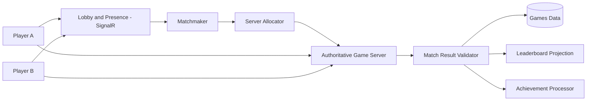

Requirements:

- The server is authoritative for movement/state that affects competition.
- Match results are signed or submitted directly by trusted game servers.
- Client leaderboard submissions are treated as untrusted.
- Reconnect tokens are short-lived and bound to match/player.
- Regional allocation considers latency, capacity, and data policy.
- Match servers emit heartbeats and can be drained during deployment.
- Abuse reports preserve relevant match/chat evidence under a defined retention policy.

## 26. Offline Game and Save Synchronization

Offline games must package all required executable assets and avoid hidden online dependencies. The platform should expose installability and download size before launch.

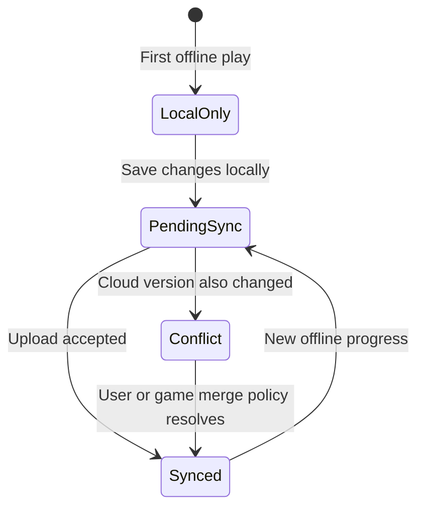

Every save has:

- `GameId`, `PlayerId`, slot, schema version, revision, checksum, and modified time.
- An opaque game-owned payload with strict size limits.
- A conflict policy: last-write-wins, server-wins, client-wins, field merge, or user selection.
- Migration support when a game changes its save schema.

Economy or competitive progression cannot trust arbitrary offline state. Keep authoritative economy balances server-side.

## 27. Games Data Model

- `Game`: metadata, status, developer, capabilities, ratings, and release channels.
- `GameBuild`: platform, version, manifest, checksum, size, and rollout state.
- `Entitlement`: player access source and validity.
- `PlayerProfile`: handle, avatar, privacy, region, and moderation state.
- `AchievementDefinition` and `PlayerAchievement`.
- `LeaderboardDefinition` and `LeaderboardEntry`.
- `SaveSlot`: revision, schema, payload reference, checksum, and sync state.
- `Party`, `Lobby`, `MatchTicket`, `Match`, and `Participant`.
- `Friendship`, `Block`, `Report`, and `ModerationAction`.

## 28. Games API Surface

```text
GET    /api/v1/games
GET    /api/v1/games/{slug}
POST   /api/v1/games/{gameId}/launch-token
GET    /api/v1/players/me
GET    /api/v1/players/me/achievements
GET    /api/v1/games/{gameId}/leaderboards/{boardId}
POST   /api/v1/games/{gameId}/saves/{slot}
GET    /api/v1/games/{gameId}/saves/{slot}
POST   /api/v1/parties
POST   /api/v1/parties/{partyId}/invites
POST   /api/v1/matchmaking/tickets
GET    /api/v1/matchmaking/tickets/{ticketId}
DELETE /api/v1/matchmaking/tickets/{ticketId}
POST   /api/v1/reports
HUB    /hubs/presence
HUB    /hubs/lobbies
```

# Part V: Cross-Cutting Quality

## 29. Security Architecture

### 29.1 Required controls

- OIDC/OAuth 2.1, PKCE, passkeys, MFA, short-lived access tokens, and refresh rotation.
- `HttpOnly`, `Secure`, and `SameSite` cookies when using a browser BFF session.
- Anti-forgery protection for state-changing browser requests.
- Content Security Policy, strict CORS, HSTS, and frame restrictions.
- Encryption in transit and at rest; managed secret storage and key rotation.
- Resource-level authorization on every conversation, asset, cart, order, save, and match.
- Malware scanning, content-type verification, decompression limits, and metadata stripping.
- SSRF protection for AI/web tools through URL normalization, DNS/IP checks, egress allow/deny policy, redirect revalidation, and response-size limits.
- Sandboxing for any untrusted code or plugin execution outside the API process.
- Signed provider webhooks, replay prevention, and idempotency.
- Immutable high-risk audit records with actor, target, action, outcome, reason, IP/device context, and trace ID.
- Rate limits, quotas, abuse detection, and denial-of-wallet protections for expensive AI/media operations.

### 29.2 Data classification

| Class | Examples | Required treatment |
| --- | --- | --- |
| Public | Published products, public game metadata | CDN allowed, integrity and cache controls |
| Internal | Feature flags, operational dashboards | Staff authorization and audit |
| Confidential | Conversations, uploads, addresses, orders, saves | Encryption, ownership checks, retention controls |
| Restricted | Payment tokens, connected-account tokens, moderation evidence | Strongest access policy, vaulting, detailed audit, minimal retention |

Do not log prompts, generated content, access tokens, payment payloads, addresses, or uploaded document text by default.

## 30. Privacy and Retention

Users must be able to:

- Export profile, conversations, generated media metadata, orders, and game records where legally applicable.
- Delete conversations and knowledge collections.
- Configure AI history and memory behavior.
- Revoke connectors and capability grants.
- Request account deletion subject to financial/legal retention obligations.
- See whether content may be used for model improvement; default to no without explicit consent.

Define separate retention schedules for raw uploads, normalized assets, model traces, safety evidence, abandoned carts, payment records, game telemetry, and moderation evidence.

## 31. Safety and Moderation

- Moderate text/image inputs and generated outputs using age, region, and product policy.
- Distinguish policy refusal from provider or technical failure.
- Prevent the AI from executing purchases, connector writes, or irreversible changes without confirmation.
- Protect against prompt injection from web pages, documents, tool descriptions, and delegated agents.
- Provide game/player reporting with block and mute controls.
- Apply human review queues for appeals, payment fraud, severe abuse, and uncertain generated media.
- Record policy version and decision outcome without unnecessarily retaining sensitive content.

## 32. Performance Targets

Initial service-level objectives should be measured at the 95th percentile.

| Operation | Target |
| --- | --- |
| Cached public catalog API | < 250 ms server response |
| Authenticated standard API | < 500 ms server response |
| AI first streamed token | < 3 s when provider is healthy |
| Chat stream reconnect | < 2 s |
| Upload-session creation | < 500 ms |
| Image job accepted | < 1 s; generation duration reported separately |
| Cart mutation | < 500 ms |
| Checkout API excluding provider challenge | < 1 s |
| Lobby/presence event propagation | < 500 ms |
| Static shell first content on broadband | < 2.5 s LCP target |

Set budgets for JavaScript, images, Unity builds, generated-media storage, tokens, and database queries. Lazy-load game runtimes and product video; never place a Unity build in the initial shell bundle.

## 33. Availability and Resilience

- Stateless APIs support horizontal scaling.
- Health endpoints distinguish liveness, readiness, and dependency health.
- External calls use timeouts, bounded retries with jitter, and circuit breakers.
- Retries apply only to safe/idempotent operations.
- Message consumers are idempotent and support dead-letter handling and replay.
- Generation jobs use leases and heartbeats to recover abandoned work.
- Redis failure must degrade cache/presence features without corrupting source-of-truth data.
- AI provider failure can route to an approved fallback or return a transparent temporary failure.
- Payment state is repaired through provider reconciliation.
- Define PostgreSQL point-in-time recovery, object-storage versioning, and restore tests.

## 34. Observability

Every request and background job carries a correlation/trace ID.

Capture:

- HTTP duration, status, route, rate-limit decision, and dependency spans.
- AI time-to-first-token, total duration, provider/model, token counts, tool timing, retrieval timing, and safety outcome.
- Media queue depth, wait time, generation time, cancellation, provider failure, and cost units.
- Commerce conversion funnel, payment failures by reason category, inventory reservation failures, and reconciliation differences.
- Game launch success, match wait time, disconnect/reconnect, server utilization, save conflicts, and moderation volume.
- Worker lag, dead letters, outbox delay, database saturation, cache hit rate, and storage errors.

Use structured logs. Redact secrets and confidential content before export. Sampling must retain errors and high-risk audit traces.

## 35. Testing Strategy

### 35.1 Automated test layers

- **Unit tests:** domain invariants, money calculations, permission decisions, save conflict rules, and routing decisions.
- **Architecture tests:** prevent module dependency violations and cross-schema infrastructure references.
- **Integration tests:** PostgreSQL, Redis, broker, blob emulator, provider adapters, and outbox behavior through Testcontainers.
- **Contract tests:** generated OpenAPI clients, payment/search/model provider adapters, game SDK compatibility, and integration events.
- **End-to-end tests:** signup, chat stream, upload and retrieval, image job, product purchase, return request, game launch, and save synchronization.
- **Security tests:** IDOR/ownership checks, SSRF, upload bombs, prompt injection, webhook replay, token misuse, and privilege escalation.
- **Performance tests:** chat concurrency, catalog traffic, checkout bursts, media queue load, presence hubs, and leaderboard reads.
- **Resilience tests:** provider timeout, broker redelivery, worker termination, Redis loss, and database failover.

### 35.2 Critical acceptance scenarios

1. Local Only AI mode completes a conversation while all outbound network access is blocked.
2. Denied web permission produces an honest degraded answer and no network request.
3. A user cannot retrieve another user's conversation, upload, order, or save by changing an identifier.
4. Duplicate payment webhooks create one payment transition and one order.
5. Inventory reservation expiry restores availability exactly once.
6. An offline save conflict follows the game's declared merge policy.
7. A forged client match result cannot update a competitive leaderboard.
8. A prompt-injected web page cannot broaden tool permissions.

## 36. Configuration and Feature Management

Use strongly typed options validated at startup. Configuration precedence:

1. Versioned non-secret defaults.
2. Environment-specific configuration.
3. Deployment environment variables.
4. Secret store references.
5. Dynamic feature/config service for approved runtime toggles.

Feature flags should control release exposure, not hide unfinished security controls. Important flags include provider enablement, image/video generation, delegated agents, commerce markets, specific games, multiplayer regions, and maintenance mode.

## 37. Deployment Topology

The architecture is cloud-neutral at the application layer. A production mapping can use any platform that provides managed PostgreSQL, Redis, object storage, messaging, secret management, container hosting, CDN/WAF, and GPU/media workers.

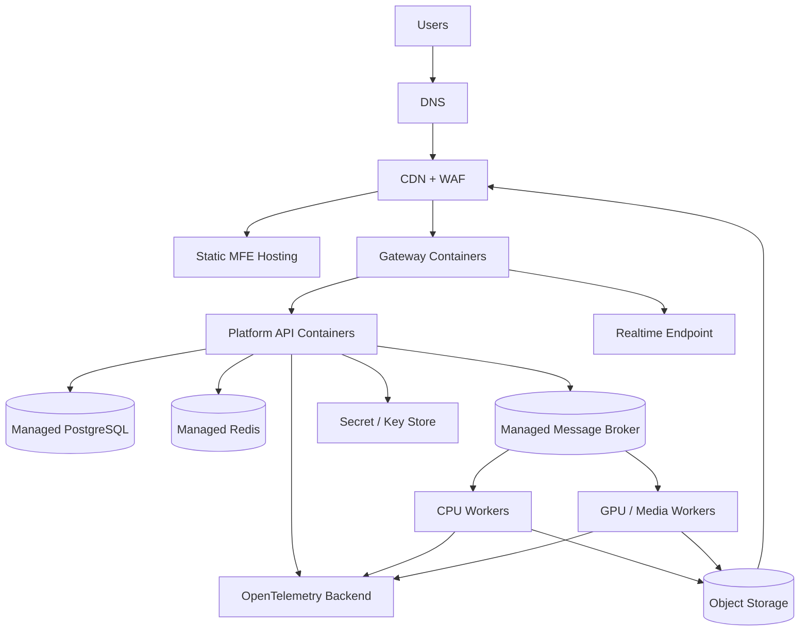

Use separate development, staging, and production environments. Production should use infrastructure as code, immutable images, vulnerability scanning, workload identity, private data-service connectivity where possible, and progressive deployment with health gates.

## 38. CI/CD Quality Gates

For every pull request:

1. Restore with lock files where supported.
2. Format and compile with warnings treated as errors.
3. Run unit and architecture tests.
4. Run affected integration and contract tests.
5. Validate OpenAPI compatibility and database migrations.
6. Run dependency, secret, container, and static security scans.
7. Build frontend bundles and enforce size budgets.
8. Publish preview artifacts where practical.

Before production:

1. Deploy to staging with production-like dependencies.
2. Run smoke, end-to-end, accessibility, and load gates.
3. Validate database migration forward and rollback/roll-forward plan.
4. Verify feature flags, secrets, rate limits, dashboards, and alerts.
5. Use canary or blue/green release for gateway/API changes.

## 39. Delivery Roadmap

### Phase 0: Architecture foundation (2-4 weeks)

- Create .NET solution, Aspire app host, service defaults, gateway, platform API, and test projects.
- Add PostgreSQL, Redis, broker, object storage emulator, OpenTelemetry, health checks, and local secrets.
- Integrate real OIDC identity with the existing auth MFE.
- Define module boundaries, API conventions, error format, idempotency, and outbox.
- Establish CI, dependency management, security scanning, and environment configuration.

**Exit criteria:** a signed-in user can call a protected profile endpoint through the gateway; traces cross gateway/API/database; local dependencies start reproducibly.

### Phase 1: Intelligence MVP (6-10 weeks)

- Add Intelligence MFE and conversation UI.
- Implement online text chat, SSE streaming, persistence, cancellation, and usage records.
- Add safe upload pipeline for images and PDFs.
- Add one vision-capable model adapter and one embedding adapter.
- Add private document ingestion, hybrid retrieval, and citations.
- Implement online capability permissions and model budget limits.

**Exit criteria:** a user can chat, upload an image/document, receive a cited answer, cancel a stream, and delete their data.

### Phase 2: Local mode and media (6-10 weeks)

- Build local companion proof of concept and pairing flow.
- Add local chat and local document retrieval with network-blocked acceptance tests.
- Add asynchronous image generation and media library.
- Add web search with citations and prompt-injection defenses.
- Add provider routing, health fallback, quota, and cost dashboards.

**Exit criteria:** Local Only mode demonstrably emits no outbound traffic; online image jobs are cancellable, auditable, and quota-controlled.

### Phase 3: Fashion MVP (8-12 weeks)

- Add commerce MFE and admin product workflows.
- Build catalog, variants, prices, inventory, search, cart, and wishlist.
- Integrate hosted payment UI, webhook processing, orders, email, and shipment state.
- Add returns foundation and operational audit trail.
- Add accessibility, performance, SEO, and analytics validation.

**Exit criteria:** a customer can discover a variant, purchase it through a real sandbox payment, receive confirmation, and view order status without overselling inventory.

### Phase 4: Play MVP (8-12 weeks)

- Add games MFE, catalog, profile, entitlement, launch tokens, and SDK.
- Ship one lightweight offline-capable game.
- Add saves, achievements, leaderboard, versioning, and sync conflict policy.
- Add presence and social foundations with block/report controls.

**Exit criteria:** an entitled user can launch online/offline, earn an achievement, synchronize a save, and appear on a validated leaderboard.

### Phase 5: Advanced capabilities (ongoing)

- Video generation and editing workflow.
- Connected tools and delegated agents.
- Premium commerce personalization and international markets.
- Matchmaking and authoritative game servers.
- Subscriptions, cross-product entitlements, and creator/developer tooling.

## 40. Suggested Initial Team

A realistic initial delivery team:

- 1 product/technical lead.
- 2-3 .NET backend engineers.
- 2 React frontend engineers.
- 1 AI/platform engineer.
- 1 cloud/platform engineer shared with backend.
- 1 product designer with accessibility capability.
- 1 QA/automation engineer.
- Part-time security and commerce/payments review.
- Game engineer(s) added before Phase 4.

Attempting AI, full commerce, and multiplayer games simultaneously with a small team will produce weak foundations. Build the shared platform and Intelligence MVP first, then run commerce and games tracks when identity, storage, observability, and deployment are stable.

## 41. Major Risks and Mitigations

| Risk | Impact | Mitigation |
| --- | --- | --- |
| Scope spans three large businesses | Delayed or shallow delivery | Stage products; enforce phase exit criteria and product ownership. |
| AI provider cost volatility | Unbounded spend | Quotas, budgets, model routing, caching where safe, and per-feature usage metering. |
| "Offline" implemented only cosmetically | Privacy breach | Local companion, egress blocking, automated no-network tests, and explicit UI state. |
| Prompt injection through web/files | Unauthorized tool/data use | Treat content as untrusted, separate instructions from evidence, re-check capabilities at execution. |
| Overselling inventory | Financial/customer harm | Reservations, atomic available quantity, expiry, idempotent order processing, reconciliation. |
| Payment webhook duplication | Duplicate orders/refunds | Signature verification, provider event inbox, idempotency, state machine. |
| Cheating in games | Loss of trust | Authoritative servers, validated results, anti-tamper signals, moderation and appeals. |
| Unity WebGL size/performance | Poor browser experience | Per-game budgets, streaming assets, compression, device capability checks, lightweight first game. |
| Premature microservices | Operational burden | Modular monolith first; extraction criteria and architecture tests. |
| Sensitive data leakage in telemetry | Privacy/security incident | Classification, redaction, sampling policy, restricted log access, automated tests. |

## 42. Architecture Decision Records to Create

Create short ADRs under `docs/decisions/` before implementation for:

1. Modular monolith and service extraction criteria.
2. Identity provider and BFF/token strategy.
3. PostgreSQL schema ownership and migration strategy.
4. Broker choice and outbox/inbox implementation.
5. Object storage and safe upload pipeline.
6. AI orchestration framework and provider abstraction.
7. Local companion packaging, pairing, and encrypted storage.
8. Web search provider and citation contract.
9. Payment provider and PCI-minimizing checkout flow.
10. Game engine and first game selection.
11. Multiplayer hosting and authoritative networking.
12. Cloud platform, regions, disaster recovery, and infrastructure as code.

## 43. Decisions Required Before Coding Product Features

- Which identity provider will be used, and are consumer social logins required at launch?
- Which countries, currencies, taxes, and shipping regions does Fashion support initially?
- Which online chat, embedding, image, and video providers are approved?
- What devices and minimum hardware must Local Only mode support?
- Is offline mode a desktop companion, packaged desktop app, or both?
- What content and safety policy applies to minors and generated media?
- Which first game demonstrates the SDK without requiring dedicated servers?
- Which cloud/hosting target and data region are required?
- What are the initial free, paid, and subscription limits?
- What data retention and deletion obligations apply in launch markets?

## 44. Definition of Platform MVP

The platform MVP is complete when:

- One identity works across shell, Intelligence, Fashion, and Play navigation.
- Resource ownership and capability scopes are enforced server-side.
- Intelligence supports streaming chat, image/document upload, citations, and a visible online permission model.
- A Local Only prototype passes a network-isolation test on supported hardware.
- Fashion supports a sandbox end-to-end purchase with correct inventory and idempotent payment processing.
- Play launches one offline-capable game with cloud save and validated achievements.
- All critical operations emit traces, metrics, structured logs, and auditable security outcomes.
- Restore procedures, incident runbooks, deployment rollback, and core end-to-end tests have been exercised.

---

This document should evolve through reviewed changes and architecture decision records. Product implementation should not silently diverge from capability consent, data ownership, payment consistency, or authoritative multiplayer requirements defined here.
